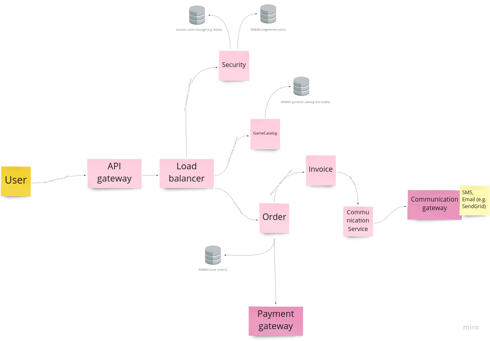

# e-commerce-poc

## Problem

Your company is selling digital games in an online store. The storefront is getting a lot of traffic,
and the game catalog is vast. Visitors can browse, search, add games to a shopping cart, and
when they are ready, they can go to order finalization, as registered users if they like. There is a
back office admin panel, where employees can manage games catalog, adjust prices etc, and
they do it quite often - they work on drafts, change it many times, and then publish the changes.

## Potentially solutions

All diagrams and additional resources can be found in `doc` directory.

### Monolithic architecture

Pros
 - All modules are deployed as one service (small communication latency)
 - Simple deployment (most often one service - modular monolith)
 - Scaling involves running many of the same instances (if system is scalable)

Minuses
 - Might be difficult to maintain, e.g. teams cannot work at the same time
 - Requires a long-term tech-stack
 - Scaling can be difficult - may not be scalable at all
 - Overloaded deployment environment

### Microservices architecture

Pros
 - Each of services can be managed by different team
 - Each of services can be scaled independently - deployment idempotence 
 - Each of services can use different tech-stack
 - Environment is highly maintainable and testable (unit / integration tests for each service + e2e)
 - Usually the simplicity of introducing changes (small specialized teams and applications divided into smaller services)

Minuses
 - Developers must deal with the additional complexity of creating a distributed system - DB relationships, deferred
   transactions, more complicated queries
 - We need additional e2e tests to check communications between services
 - Implementing requests that span multiple services requires careful coordination between the teams

### Used architecture

I decided to propose solution based on microservices architecture. We can independently scale our services
depending on the traffic. Services are designed using `Database per service` pattern.

### Proposed solution

The system was divided into 4 main services - small modular, specialized monoliths, where each of them could be split
as a separate deployment in the future (high modular based abstraction).

1. Security

Users authentication, registration and session management center. While user log in (e.g. administrators), revive
`Access Token` (JWT) to communicate with other (secured) APIs.

2. GameCatalog

Allows to users get current (live) games catalog and administrators to manage them (drafts, publications).

3. Order

Allows to users to place orders (payments, invoices).

4. CommunicationService

Height abstraction to send notifications, e-mails, sms to users

### Tech-stack

It is true that the microservices architecture allows the use of an independent technology stack, but I decided to use
a Spring Boot framework. There was information in the description of our problem about huge traffic. In the initial phase
of implementation, I was thinking about use `Spring WebFlux` and prepare solution in a reactive paradigm. It turned out
that `R2DBC` [doesn't support relationship](https://github.com/spring-projects/spring-data-r2dbc/issues/356), so I stayed
with `Spring JPA`. It is true that I could manage entities manually by storing columns mapping to id, but in the end I
stayed with the non-reactive solution keeping the field for optimization - better entity management or solution
not based on RDBMS. I decided to use PostgreSQL as RDBMS - I just have experience with this database, and it would be
good for relationships purposes with `Hibernate`.
